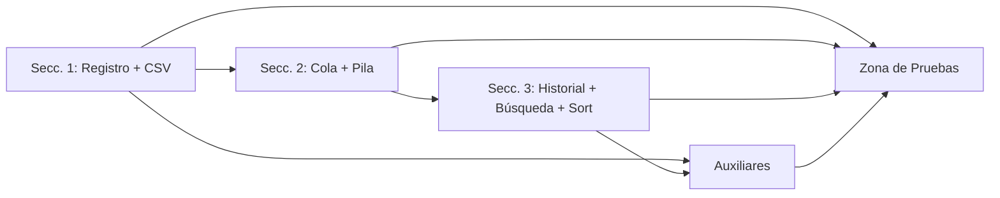
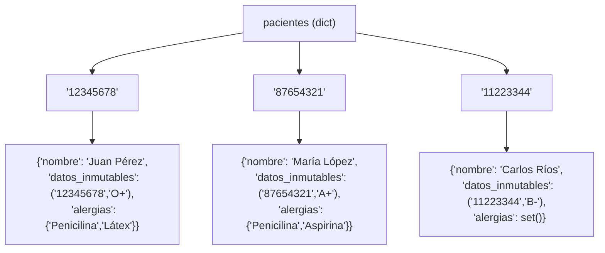
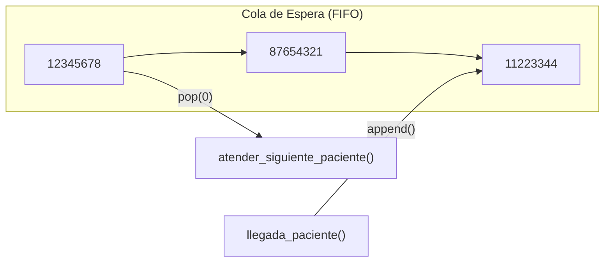
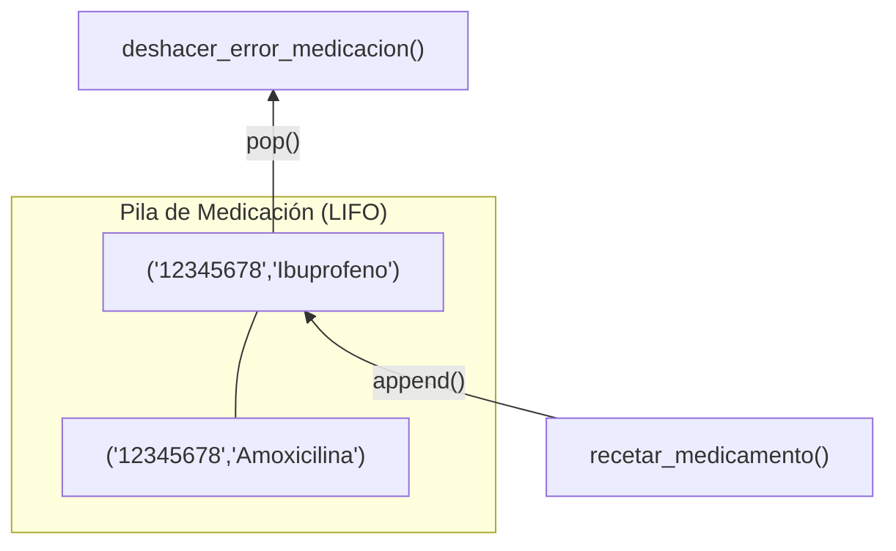

# Walkthrough Completo — Sistema Hospitalario

## Tabla de Contenidos
1. [Visión General](#visión-general)
2. [Arquitectura de Datos en Memoria](#arquitectura-de-datos-en-memoria)
3. [Sección 1: Registro y Carga de Datos](#sección-1-registro-y-carga-de-datos)
4. [Sección 2: Flujo de Atención Dinámica](#sección-2-flujo-de-atención-dinámica)
5. [Sección 3: Historiales, Búsqueda y Ordenamiento](#sección-3-historiales-búsqueda-y-ordenamiento)
6. [Funciones Auxiliares](#funciones-auxiliares)
7. [Zona de Pruebas y Resultados](#zona-de-pruebas-y-resultados)
8. [Mapa de Complejidad Algorítmica](#mapa-de-complejidad-algorítmica)
9. [Diseño para Refactorización a POO](#diseño-para-refactorización-a-poo)

---

## Visión General

El proyecto vive en un **solo archivo**: [sistema_hospitalario.py](file:///C:/Users/Lolie/.gemini/antigravity/scratch/clinica_system/sistema_hospitalario.py) (345 líneas), con un CSV de datos de prueba: [pacientes.csv](file:///C:/Users/Lolie/.gemini/antigravity/scratch/clinica_system/datos/pacientes.csv).

Sigue estrictamente la guía del notebook, organizado en **3 secciones** más una zona de pruebas:



Cada sección usa una combinación específica de las **4 estructuras nativas**:

| Estructura | Propósito en el proyecto | Por qué se eligió |
|------------|------------------------|--------------------|
| **Diccionario** (`dict`) | Catálogos de pacientes y personal, nodos de lista enlazada | Búsqueda por clave en O(1) |
| **Tupla** (`tuple`) | Datos inmutables: (DNI, tipo_sangre), recetas: (dni, medicamento) | **No se puede modificar** después de crear |
| **Conjunto** (`set`) | Alergias de cada paciente | Búsqueda con `in` en O(1), operaciones de conjunto |
| **Lista** (`list`) | Cola de espera, pila de medicación, extracción de claves para ordenar | Orden secuencial, append/pop |

---

## Arquitectura de Datos en Memoria

### Diccionario `pacientes` — Línea 24



Cada registro de paciente contiene **3 tipos de estructura anidados**:

```python
pacientes["12345678"] = {
    "nombre": "Juan Pérez",                     # str — dato mutable
    "datos_inmutables": ("12345678", "O+"),      # TUPLA — no se puede cambiar
    "alergias": {"Penicilina", "Látex"},         # SET — búsqueda O(1)
}
```

> [!IMPORTANT]
> **¿Por qué tupla para datos inmutables?** Si alguien intenta hacer `datos_inmutables[0] = "otro_dni"`, Python lanza `TypeError`. Esto protege por diseño los datos que nunca deben cambiar (DNI, tipo de sangre).

> [!IMPORTANT]
> **¿Por qué set para alergias?** Buscar `"Penicilina" in alergias` es O(1) en un set vs O(n) en una lista. Para un hospital con miles de pacientes y verificaciones de alergias antes de cada receta, esto es crítico.

### Diccionario `personal` — Líneas 28-32

```python
personal = {
    "EMP01": {"nombre": "Dra. Gómez",  "rol": "Especialista",    "nivel_acceso": 3},
    "EMP02": {"nombre": "Dr. Pérez",   "rol": "Médico General",  "nivel_acceso": 2},
    "EMP03": {"nombre": "Enf. Ruiz",   "rol": "Enfermera",       "nivel_acceso": 1},
}
```

El `nivel_acceso` funciona como sistema de permisos jerárquico:

| Nivel | Rol | Puede recetar | Puede deshacer |
|-------|-----|:---:|:---:|
| 3 | Especialista | Si | Si |
| 2 | Médico General | Si | Si |
| 1 | Enfermera | No | No |

La validación se hace con una simple comparación numérica (`nivel < 2`), lo cual es extensible a más niveles en el futuro.

---

## Sección 1: Registro y Carga de Datos

### `registrar_paciente()` — [Líneas 35-54](file:///C:/Users/Lolie/.gemini/antigravity/scratch/clinica_system/sistema_hospitalario.py#L35-L54)

```python
def registrar_paciente(dni, nombre, tipo_sangre, lista_alergias):
```

**Flujo interno paso a paso:**

```
Entrada: dni="12345678", nombre="Juan", tipo_sangre="O+", lista_alergias=["Penicilina","Látex"]
         │
         ▼
    ┌─ Paso 1: Crear tupla ──────────────────────┐
    │  datos_inmutables = ("12345678", "O+")      │  ← TUPLA: inmutable por diseño
    └─────────────────────────────────────────────┘
         │
         ▼
    ┌─ Paso 2: Crear set ────────────────────────┐
    │  alergias = {"Penicilina", "Látex"}         │  ← SET: de lista a conjunto
    └─────────────────────────────────────────────┘
         │
         ▼
    ┌─ Paso 3: Almacenar en dict ────────────────┐
    │  pacientes["12345678"] = {                  │
    │      "nombre": "Juan",                      │
    │      "datos_inmutables": tupla,              │
    │      "alergias": set                        │
    │  }                                          │
    └─────────────────────────────────────────────┘
```

> [!NOTE]
> La función recibe `lista_alergias` como **lista** (porque así viene del CSV o del usuario) y la **convierte a set internamente** con `set(lista_alergias)`. El usuario no necesita saber que internamente se usa un set.

### `cargar_pacientes_csv()` — [Líneas 57-84](file:///C:/Users/Lolie/.gemini/antigravity/scratch/clinica_system/sistema_hospitalario.py#L57-L84)

```python
def cargar_pacientes_csv(ruta_archivo):
```

Lee el archivo [pacientes.csv](file:///C:/Users/Lolie/.gemini/antigravity/scratch/clinica_system/datos/pacientes.csv):

```
DNI,Nombre,Tipo_Sangre,Alergias
55667788,Ana Torres,AB+,Penicilina-Sulfa
99887766,Luis García,O-,Látex
33445566,Rosa Medina,A-,Aspirina-Ibuprofeno-Penicilina
22334455,Pedro Sánchez,B+,
```

**Proceso de transformación de cada fila:**

```
Fila CSV:  "33445566,Rosa Medina,A-,Aspirina-Ibuprofeno-Penicilina"
                                      │
                                      ▼ split("-")
                           ["Aspirina", "Ibuprofeno", "Penicilina"]
                                      │
                                      ▼ registrar_paciente()
                           {"Aspirina", "Ibuprofeno", "Penicilina"}  ← SET
```

> [!NOTE]
> El separador de alergias es el guion `-` (no coma), porque la coma ya es el delimitador del CSV. `next(lector)` en la línea 69 salta la cabecera para no procesarla como datos.

---

## Sección 2: Flujo de Atención Dinámica

### Cola de Espera (FIFO) — `cola_espera`



**FIFO = First In, First Out** (primero en llegar, primero en ser atendido):

| Función | Operación de lista | Efecto |
|---------|-------------------|--------|
| [llegada_paciente(dni)](file:///C:/Users/Lolie/.gemini/antigravity/scratch/clinica_system/sistema_hospitalario.py#L96-L102) | `cola_espera.append(dni)` | Agrega **al final** |
| [atender_siguiente_paciente()](file:///C:/Users/Lolie/.gemini/antigravity/scratch/clinica_system/sistema_hospitalario.py#L105-L119) | `cola_espera.pop(0)` | Saca **el primero** |

**Ejemplo de ejecución secuencial:**

```
Estado inicial:    cola_espera = []

llegada("12345678")  →  ["12345678"]
llegada("87654321")  →  ["12345678", "87654321"]
llegada("11223344")  →  ["12345678", "87654321", "11223344"]

atender()  →  retorna "12345678"  →  ["87654321", "11223344"]
atender()  →  retorna "87654321"  →  ["11223344"]
atender()  →  retorna "11223344"  →  []
atender()  →  "No hay pacientes"  →  retorna None
```

### Pila de Medicación (LIFO) + Control de Acceso — `pila_medicacion`



**LIFO = Last In, First Out** (la última receta es la primera en deshacerse):

| Función | Operación | Efecto |
|---------|----------|--------|
| [recetar_medicamento()](file:///C:/Users/Lolie/.gemini/antigravity/scratch/clinica_system/sistema_hospitalario.py#L122-L144) | `pila_medicacion.append(tupla)` | Push: agrega **arriba** |
| [deshacer_error_medicacion()](file:///C:/Users/Lolie/.gemini/antigravity/scratch/clinica_system/sistema_hospitalario.py#L147-L163) | `pila_medicacion.pop()` | Pop: saca **el de arriba** |

**Control de acceso en `recetar_medicamento()`:**

```python
# Línea 134-138
nivel = personal[id_empleado]["nivel_acceso"]
if nivel < 2:
    print("Acceso denegado...")
    return
```

```
recetar("12345678", "Amoxicilina", "EMP01")  →  nivel=3 >= 2  →  OK, push
recetar("12345678", "Ibuprofeno",  "EMP02")  →  nivel=2 >= 2  →  OK, push
recetar("87654321", "Paracetamol", "EMP03")  →  nivel=1 < 2   →  DENEGADO

Pila: [("12345678","Amoxicilina"), ("12345678","Ibuprofeno")]
                                         ↑ tope de la pila

deshacer()  →  pop()  →  saca ("12345678","Ibuprofeno")  ← último añadido
Pila: [("12345678","Amoxicilina")]
```

> [!IMPORTANT]
> Las recetas se guardan como **tuplas** `(dni, medicamento)` — no como dicts. Esto es intencional: una receta emitida no debería poder modificarse, solo anularse (sacándola de la pila).

---

## Sección 3: Historiales, Búsqueda y Ordenamiento

### Lista Enlazada con Diccionarios — `cabeza_historial`

Esta es la estructura más compleja del proyecto. Simula una **lista enlazada** sin clases, usando **diccionarios como nodos**:

```python
# Cada nodo es un dict:
nodo = {"diagnostico": "Gripe estacional", "siguiente": None}
```

[agregar_registro_historial()](file:///C:/Users/Lolie/.gemini/antigravity/scratch/clinica_system/sistema_hospitalario.py#L175-L200) construye la cadena:

```
Después de 3 inserciones para DNI "12345678":

cabeza_historial["12345678"]
       │
       ▼
┌──────────────────────┐     ┌──────────────────────────┐     ┌────────────────────┐
│ diagnostico:         │     │ diagnostico:             │     │ diagnostico:       │
│   "Gripe estacional" │────▶│   "Control post-tratam." │────▶│   "Alergia cutánea"│
│ siguiente: ──────────┤     │ siguiente: ──────────────┤     │ siguiente: None    │
└──────────────────────┘     └──────────────────────────┘     └────────────────────┘
     Nodo 1 (cabeza)              Nodo 2                          Nodo 3 (cola)
```

**Algoritmo de inserción al final (líneas 194-200):**

```python
# Empezar desde la cabeza
nodo_actual = cabeza_historial[dni]           # → Nodo 1

# Recorrer mientras haya "siguiente"
while nodo_actual["siguiente"] is not None:   # Nodo 1 → Nodo 2 → Nodo 3 (None!)
    nodo_actual = nodo_actual["siguiente"]

# Enlazar el nuevo nodo al final
nodo_actual["siguiente"] = nuevo_nodo         # Nodo 3.siguiente = Nodo 4
```

> [!NOTE]
> **¿Por qué lista enlazada con dicts y no una simple lista?** La guía lo pide explícitamente como ejercicio conceptual. En la refactorización a POO, cada nodo se convertirá en una instancia de `class Nodo`.

### Ordenamiento Burbuja Manual — [Líneas 203-222](file:///C:/Users/Lolie/.gemini/antigravity/scratch/clinica_system/sistema_hospitalario.py#L203-L222)

```python
def ordenar_pacientes_por_dni():
```

La guía prohíbe usar `sort()`. Se implementa **Bubble Sort**:

```
Lista inicial:  ["12345678", "87654321", "11223344"]

Pasada 1:
  Comparar [0] y [1]: "12345678" < "87654321"  →  no swap
  Comparar [1] y [2]: "87654321" > "11223344"  →  SWAP
  Resultado: ["12345678", "11223344", "87654321"]
                                       ▲ el mayor "burbujea" al final

Pasada 2:
  Comparar [0] y [1]: "12345678" > "11223344"  →  SWAP
  Resultado: ["11223344", "12345678", "87654321"]

Lista final:    ["11223344", "12345678", "87654321"]  ✓ ordenada
```

### Búsqueda Rápida de Alergias — [Líneas 225-240](file:///C:/Users/Lolie/.gemini/antigravity/scratch/clinica_system/sistema_hospitalario.py#L225-L240)

```python
def busqueda_rapida_alergia(dni, alergia_a_buscar):
```

Dos búsquedas O(1) encadenadas:

```
busqueda_rapida_alergia("12345678", "Penicilina")
        │
        ▼
    ┌─ Paso 1: Buscar en dict ─────────────────────────┐
    │  pacientes["12345678"]   →  O(1) por hash table   │
    └───────────────────────────────────────────────────┘
        │
        ▼
    ┌─ Paso 2: Buscar en set ──────────────────────────┐
    │  "Penicilina" in {"Penicilina", "Látex"}  →  O(1) │
    └───────────────────────────────────────────────────┘
        │
        ▼
      True
```

> [!TIP]
> Si las alergias fueran una **lista** en vez de un **set**, esta búsqueda sería O(n) — tendría que recorrer toda la lista. Con set, es O(1) promedio gracias al hash table interno de Python.

---

## Funciones Auxiliares

### `mostrar_historial(dni)` — [Líneas 247-259](file:///C:/Users/Lolie/.gemini/antigravity/scratch/clinica_system/sistema_hospitalario.py#L247-L259)

Recorre la lista enlazada desde la cabeza hasta `None`, imprimiendo cada nodo:

```python
nodo = cabeza_historial[dni]    # Empezar en la cabeza
while nodo is not None:         # Mientras haya nodos
    print(nodo['diagnostico'])  # Imprimir dato
    nodo = nodo["siguiente"]    # Avanzar al siguiente
```

### `cruzar_alergias(dni1, dni2)` — [Líneas 262-279](file:///C:/Users/Lolie/.gemini/antigravity/scratch/clinica_system/sistema_hospitalario.py#L262-L279)

Demuestra las **4 operaciones fundamentales de conjuntos** en un caso de uso real:

```python
alergias_juan  = {"Penicilina", "Látex"}
alergias_maria = {"Penicilina", "Aspirina"}

alergias_juan & alergias_maria   # → {"Penicilina"}            Intersección
alergias_juan | alergias_maria   # → {"Penicilina","Látex","Aspirina"}  Unión
alergias_juan - alergias_maria   # → {"Látex"}                 Diferencia
alergias_maria - alergias_juan   # → {"Aspirina"}              Diferencia inversa
```

> [!TIP]
> **Caso de uso médico real:** Antes de recetar un medicamento a un grupo de pacientes, puedes verificar qué alergias tienen **en común** (intersección) para evitar reacciones adversas compartidas.

---

## Zona de Pruebas y Resultados

La zona de pruebas ([líneas 286-344](file:///C:/Users/Lolie/.gemini/antigravity/scratch/clinica_system/sistema_hospitalario.py#L286-L344)) ejecuta **7 pruebas** que verifican todas las funcionalidades:

| # | Prueba | Qué valida |
|---|--------|-----------|
| 1 | Registro y Estructuras | `registrar_paciente()` crea tupla + set correctamente |
| 2 | Búsqueda rápida | `busqueda_rapida_alergia()` retorna `True`/`False` en O(1) |
| 3 | Cruce de alergias | Operaciones `&`, `\|`, `-` sobre sets |
| 4 | Cola de espera | FIFO: primero en entrar es primero en salir |
| 5 | Pila de medicación | LIFO: deshace la última receta + control de acceso |
| 6 | Historial clínico | Lista enlazada: 3 nodos recorridos en orden |
| 7 | Ordenamiento | Burbuja manual ordena DNIs correctamente |

**Salida completa de la ejecución:**

```
--- INICIANDO PRUEBA 1: Registro y Estructuras ---
Pacientes registrados: 3
  DNI: 12345678
    Nombre: Juan Pérez
    Datos inmutables (tupla): ('12345678', 'O+')
    Alergias (set): {'Látex', 'Penicilina'}
    Tipo datos_inmutables: tuple
    Tipo alergias: set
  ...

--- PRUEBA 2: Búsqueda rápida de alergias (Sets) ---
  ¿Juan tiene alergia a Penicilina? True
  ¿Juan tiene alergia a Ibuprofeno? False

--- PRUEBA 3: Cruce de alergias (Operaciones de Sets) ---
  Alergias comunes: {'Penicilina'}
  Todas las alergias: {'Aspirina', 'Látex', 'Penicilina'}
  Solo Juan: {'Látex'}
  Solo María: {'Aspirina'}

--- PRUEBA 4: Cola de espera (FIFO) ---
  Cola de espera: ['12345678', '87654321', '11223344']
  Atendido: 12345678
  Cola restante: ['87654321', '11223344']

--- PRUEBA 5: Pila de medicación (LIFO) ---
  Receta registrada: Amoxicilina para paciente 12345678
  Receta registrada: Ibuprofeno para paciente 12345678
  Acceso denegado: Enf. Ruiz (nivel 1) no tiene permiso
  Pila de medicación: [('12345678', 'Amoxicilina'), ('12345678', 'Ibuprofeno')]
  [!] ALERTA: Receta ANULADA -- Ibuprofeno del paciente 12345678
  Pila tras deshacer: [('12345678', 'Amoxicilina')]

--- PRUEBA 6: Historial clínico (Lista enlazada) ---
  1. Gripe estacional
  2. Control post-tratamiento
  3. Alergia cutánea

--- PRUEBA 7: Ordenamiento manual por DNI (Burbuja) ---
  DNIs ordenados: ['11223344', '12345678', '87654321']

=== TODAS LAS PRUEBAS COMPLETADAS ===
```

---

## Mapa de Complejidad Algorítmica

| Operación | Función | Complejidad | Estructura |
|-----------|---------|:-----------:|------------|
| Buscar paciente por DNI | `pacientes[dni]` | **O(1)** | dict (hash table) |
| Verificar alergia | `alergia in paciente["alergias"]` | **O(1)** | set (hash table) |
| Verificar nivel acceso | `personal[id]["nivel_acceso"]` | **O(1)** | dict |
| Encolar paciente | `cola_espera.append(dni)` | **O(1)** | list (amortizado) |
| Desencolar paciente | `cola_espera.pop(0)` | **O(n)** | list (desplaza elementos) |
| Push receta | `pila_medicacion.append(tupla)` | **O(1)** | list |
| Pop receta | `pila_medicacion.pop()` | **O(1)** | list |
| Agregar al historial | recorrer lista enlazada | **O(k)** | dict-nodos (k = largo) |
| Cruzar alergias | `set1 & set2` | **O(min(n,m))** | set |
| Ordenar por DNI | Bubble Sort | **O(n²)** | list |

> [!NOTE]
> `pop(0)` es O(n) porque Python debe desplazar todos los elementos una posición. En la fase de refactorización a POO, esto se reemplazará por `collections.deque` que tiene `popleft()` en O(1).

---

## Diseño para Refactorización a POO

Cada estructura actual tiene un mapeo directo a clases futuras:

| Actual (sin POO) | Futuro (con POO) |
|-------------------|-----------------|
| `pacientes = {}` + `registrar_paciente()` | `class Paciente` + `class RegistroPacientes` |
| `personal = {}` + validación de nivel | `class Empleado` → herencia: `class Medico(Empleado)`, `class Enfermera(Empleado)` |
| `cola_espera = []` + `append`/`pop(0)` | `class ColaEspera` con `collections.deque` |
| `pila_medicacion = []` + `append`/`pop` | `class PilaMedicacion` con encapsulamiento |
| Nodo como dict `{"diagnostico":..., "siguiente":...}` | `class Nodo` con atributos `self.dato`, `self.siguiente` |
| `cabeza_historial = {}` | `class ListaEnlazada` con métodos `insertar()`, `recorrer()` |
| `ordenar_pacientes_por_dni()` | Método de `RegistroPacientes.ordenar()` |

> [!TIP]
> El patrón actual de funciones que operan sobre variables globales (`pacientes`, `cola_espera`, etc.) se convertirá naturalmente en **métodos** que operan sobre `self`. Por ejemplo:
> ```python
> # Actual:
> def registrar_paciente(dni, nombre, tipo_sangre, lista_alergias):
>     pacientes[dni] = {...}
>
> # Futuro POO:
> class RegistroPacientes:
>     def registrar(self, dni, nombre, tipo_sangre, lista_alergias):
>         self.pacientes[dni] = Paciente(dni, nombre, tipo_sangre, lista_alergias)
> ```
